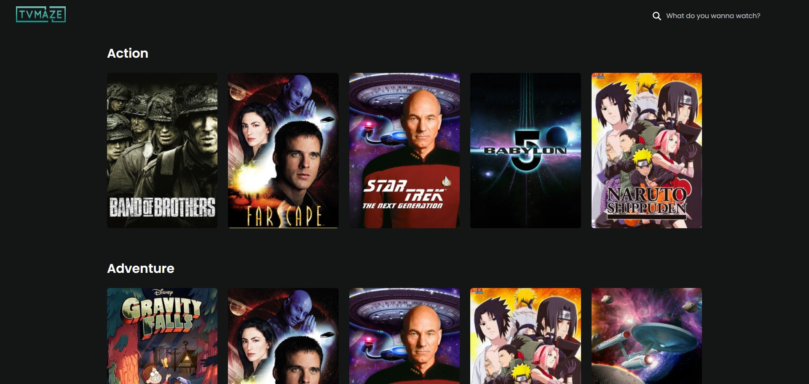

# TV Shows

Coding test for a client, using the [TVMaze API](https://www.tvmaze.com/api). Made with Vue 3 and Vite.



## Requirements

- [Node v20.10.0](https://nodejs.org/en)
- [NPM 10.3.0](https://www.npmjs.com/)

## Scripts

```bash
# install dependencies
npm i

# run dev server
npm run dev
```
